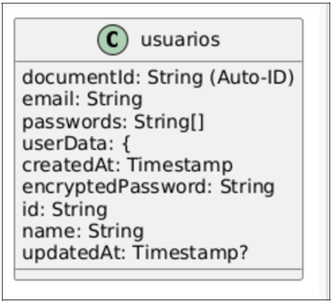



**UNIVERSIDAD PRIVADA DE TACNA** 

**FACULTAD DE INGENIERÍA** 

**Escuela Profesional de Ingeniería de Sistemas** 

**Diccionario de Datos** 

**Sistema Gestor de contraseñas: ChargePass** 

Curso: *Patrones de Software*\
Docente: Mag. *Patrick Cuadros Quiroga* 

Integrantes: 

**Nina Vargas, Luigui Augusto          (2019065166) Chambe Torres, Edgard Reynaldo                 (2019064917)  Condori Vargas,Tomas Yoel                (2018000487)**  

**Tacna – Perú** 

***2025***

**Sistema Gestor de contraseñas: ChargePass** 

**Diccionario de Datos** 

**Versión *{1.0}*** 

**ÍNDICE GENERAL** 

1. [**Modelo Entidad / relación**  4 ](#_page3_x85.05_y112.25)
1. **Diseño lógico**  4 
1. [**Diseño Físico**  4 ](#_page3_x85.05_y158.74)
2. [**DICCIONARIO DE DATOS**  4](#_page4_x85.05_y508.48) 

**2.1.**  **Tablas**  4 

1. **Procedimientos Almacenados**  4 
1. **Lenguaje de Definición de Datos (DDL)**  5 
1. **Lenguaje de Manipulación de Datos (DML)**  5 

**Diccionario de Datos** 

1. **Modelo No relacional** 

*Gráfico 02: Diagrama de Base de Datos no Relacional* 

*Fuente: Elaboración propia del equipo de trabajo* 

*En la gráfica Nº 01 : Apreciamos el gráfico de nuestro Diagrama de Base de Datos(Físico) no relacional con los atributos y tipo de dato de las tablas.* 

2. **DICCIONARIO DE DATOS** 

*Tabla 1:Tabla Usuarios*

|**Nombre de la Tabla:** |Usuarios ||||||
| - | - | :- | :- | :- | :- | :- |
|**Descripción de la Tabla:** |Almacena información sobre los usuarios del sistema ||||||
|**Objetivo:** |Gestionar  los  datos  de  acceso  y  roles  de  los usuarios. ||||||
|**Relaciones con otras Tablas:** |Al  ser  una  base  de  datos  no  relacional,no  se relaciona con otras tablas ||||||
|**Descripción de los campos** |||||||
|**Nro.** |**Nombre del campo** |**Tipo dato longitud** |**Permite nulos** |**Clave primaria** |**Clave foránea** |
**Descripción del** 

**campo** 
|
|1 |documentld |string |No |Sì |No |Identificador  único para el usuario. |
|2 |email |string |No |No |No |Correo del usuario |
|3 |passwords |string |No |No |No |Contraseña |
|4 |userData |String(20) |No |No |No |Documento  de dato usuario |
|5 |createdAt |Timestamp |No |No |No |creación  de  la fecha |
|6 |encryptedPas sword |String(100) |No |No |No |encriptación  de contraseña |
|7 |id |string |No |No |No |id único |
|8 |name |String(50) |No |No |No |nombre del user |
|9 |updateAt |Timestamp |No  |No |No |Captura  |

*Fuente: Elaboración propia del equipo de trabajo* 

*En la Tabla Nº1: Esta tabla almacena la información de los usuarios que acceden al sistema, incluyendo su nombre, credenciales, rol y estado de actividad.* 
