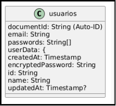



**UNIVERSIDAD PRIVADA DE TACNA**

**FACULTAD DE INGENIERÍA**

**Escuela Profesional de Ingeniería de Sistemas**

` `**Proyecto:** 

**Sistema Gestor de contraseñas: ChargePass**

Curso: *Patrones de Software*

Docente: Mag. Patrick Cuadros Quiroga

**Integrantes:**

` `Chambe Torres, Edgard Reynaldo		(2019064917)

Nina Vargas, Luigui Augusto 			(2019065166)

Condori Vargas,Tomas Yoel                     (2018000487)**	

**Tacna – Perú**

**2025**

**Sistema Gestor de Contraseñas: ChargePass**

**Documento de Estándares de Programación**

**Versión 1.0**

|Sistema Gestor de Contraseñas: ChargePass|`  `Versión 1.0|
| :- | -: |
|Documento de Estándares de Programación||

**Historia de Revisión**

|**Historial de revisiones**||||||
| :-: | :- | :- | :- | :- | :- |
|**Ítem**|**Fecha**|**Versión**|**Descripción**|**Equipo**||
|1|14/06/25|1\.0|Versión Final.|
Luigui Nina, Edgard Chambe, Tomas Condori

||

**Tabla de Contenidos**

\1.	OBJETIVO	

\2.	DECLARACIÓN DE VARIABLES	

2.1	Descripción de la Variable.	

2.2	Variables de Tipo Arreglo	

\3.	Definición de Controles	

3.1	Tipo de datos	

3.2	Prefijo para el Control	

3.3	Nombre descriptivo del Control	

3.4	Declaración de variables, atributos y objetos	

3.5	Declaración de clases	

3.6	Control de versiones de código fuente	

\4.	Clases.	

\5.	Procedimientos definidos por el Usuario.	

\6.	Beneficios	

\7.	Conclusiones	

**Estándares de Programación**

1. **OBJETIVO**

Reglamentar la forma en que se implementará el código fuente del proyecto, pasando, por las variables, controles, clases, métodos, ficheros, archivos y todo aquello que esté implicado en el código,

Mejorar y uniformizar a través de las reglas que se proponen, el estilo de programación que tiene cada programador.

- Los nombres de variables serán mnemotécnicos con lo que se podrá saber el tipo de dato de cada variable con sólo ver el nombre de la variable.
- Los nombres de variables serán sugestivos, de tal forma que se podrá saber el uso y finalidad de dicha variable o función fácilmente con solo ver el nombre de la variable.
- La decisión de poner un nombre a una variable o función será mecánica y automática, puesto que seguirá las reglas definidas por nuestro estándar.
- Permite el uso de herramientas automáticas de verificación de nomenclaturas.

Por tanto, se seguirán dichos patrones para un entendimiento legible del código y para facilitar el mantenimiento del mismo.

1. **DECLARACIÓN DE VARIABLES**

Se propone que la declaración de las variables, se ajusten al motivo para la que se requieran. El mnemotécnico definido se establece tomando en consideración principalmente lo siguiente:

- La longitud debe ser lo más recomendable posible. No debe ser tan grande de tal forma que el programador tenga la facilidad de manejo sobre la variable y ni tan corta que no pueda describirse claramente. Para el caso establecemos una longitud máxima de variable de 16 caracteres.
- Alcance de la variable

  A medida que aumenta el tamaño del proyecto, también aumenta la utilidad de reconocer rápidamente el alcance de las variables. Esto se consigue al escribir un prefijo de alcance de una letra delante del tipo de prefijo propio, sin aumentar demasiado la longitud del nombre de las variables.

- El tipo de dato al que pertenece la variable.

  Por lo tanto la estructura de la variable es como sigue:

|**Estructura**|**Descripción de la Variable**|
| - | - |
|LONGITUD. MAX.|🡨   1   🡪🡨                 16                🡪|
|FORMATO|*Minúscula la primera parte y luego la segunda con Mayúsculas*|
|EJEMPLO|numCuenta|

1. **Descripción de la Variable.**

   Nombre que se le asignará a la variable para que se le identifique y deberá de estar asociada al motivo para la cual se le declara.

**Contraseñas(Password)**

|**Nombre de la Variable**|**Descripción**|
| :-: | :-: |
|id|Identificador único generado para cada contraseña. Se genera automáticamente con DateTime.now().millisecondsSinceEpoch.toString().|
|name|Nombre asignado por el usuario para identificar la contraseña (por ejemplo, "Correo personal", "Cuenta bancaria", etc.).|
|encryptedPassword|Contraseña cifrada utilizando el servicio de encriptación (EncryptionService). Se almacena de forma segura en Firestore.|
|createdAt|Fecha y hora en que se creó la contraseña. Se asigna automáticamente al momento de guardarse.|
|updatedAt|Fecha y hora en que se actualizó por última vez la contraseña. Es null inicialmente y se actualiza solo cuando se modifica la contraseña.|

**Control de Versiones (VersionCheckerService)**

|**Nombre de la Variable**|**Descripción**|
| :-: | :-: |
|\_instance|Instancia estática de la clase VersionCheckerService para aplicar el patrón Singleton. Permite que solo exista una instancia global del servicio en toda la app.|
|\_firestore|Instancia de FirebaseFirestore usada para acceder y leer datos desde la colección version en Firestore.|
|\_initialized|Bandera booleana que indica si ya se ha iniciado el listener de versiones. Evita inicializaciones múltiples.|

**Usuarios (UserModel)**

|**Nombre de la Variable**|**Descripción**|
| :-: | :-: |
|email|Correo electrónico del usuario. Se utiliza como identificador y medio de contacto en la aplicación.|

**Servicio de Autenticación (FirebaseAuthService)**

|**Nombre de la Variable**|**Descripción**|
| :-: | :-: |
|\_auth|Instancia de FirebaseAuth utilizada para manejar operaciones de autenticación como login, logout, etc.|
|\_firestore|Instancia de FirebaseFirestore utilizada para guardar información adicional del usuario en Firestore.|

1. **Variables de Tipo : BASE DE DATOS**

En el caso de la definición de tipo se trabajara con la base de datos SQL Server  se declarará las variable o atributos que presentaran las tablas con el tipo de dato específico para cada una de ellas,el cual será un tipo de variable definida y almacenada en las tablas de la base de datos llamada “ChargePass”.

**Definición de Controles**

Para poder determinar el nombre de un control dentro de cualquier aplicación de tipo visual, se procede a identificar el tipo al cual pertenece y la función que cumple dentro de la aplicación.

1. **Tipo de datos**

|**Tipo de variable**|**Mnemónico**|**Descripción**|
| :-: | :-: | :-: |
|Byte|by|Entero de 8 bits sin signo.|
|Integer|in|Entero de 32 bits con signo.|
|Char|ch|Un carácter UNICODE de 16 bits|
|String|st|Cadena de caracteres|
|Date|dt|Formato de fecha/hora|
|Boolean|bl|Valor lógico: verdadero y falso|
|Float|fl|Coma flotantes, 11-12 dígitos significativos.|
|Double|db|Coma flotante, 64 bits (15-16 dígitos significativos)|
|Object|ob|Objeto genérico |

1. **Declaración de clases**

|**Clase**|**Descripción**|
| :-: | :-: |
|**Sintaxis**|[Tipo] Class [Nombre de Clase]|
|**Descripción**|El nombre de las clases tendrá una longitud máxima de 30 caracteres y las primeras letras de todas las palabras estarán en mayúsculas. Tipo se refiere a si la clase será: Private, Public o Protected.|
|**Observaciones**|
En la declaración de clases no se deberá utilizar caracteres como:

- Letra Ñ o ñ.

- Caracteres especiales ¡, ^, #, $, %, &, /, (, ), ¿, ‘, +, -, \*, {, }, [, ].

- Caracteres tildados: á, é, í, ó, ú.
|
|**Ejemplo**|
Private Class Empleado

Indica una clase Empleado
|

|**Clase**|**Descripción**|
| :-: | :-: |
|**Sintaxis**|class FirebaseAuthService|
|**Descripción**|Clase pública utilizada para manejar las operaciones de autenticación con Firebase Authentication y Firestore.|
|**Observaciones**|
En la declaración de esta clase no se utilizara caracteres como:

- Letra Ñ o ñ.

- Caracteres especiales ¡, ^, #, $, %, &, /, (, ), ¿, ‘, +, -, \*, {, }, [, ].

- Caracteres tildados: á, é, í, ó, ú.
|
|**Ejemplo**|
class FirebaseAuthService with ChangeNotifier {}

Indica una clase pública en Dart llamada FirebaseAuthService, que extiende ChangeNotifier para notificar a los widgets de cambios, usada en la gestión de autenticación con Firebase.
|

1. **Control de versiones de código fuente** 

Cada modificación realizada será guardada de la forma:

|**Título**|**Descripción**|
| :-: | :-: |
|**Formato**|[NOMBRE DOCUMENTO][ \_ ][FECHA][ \_ ][HORA] donde y la fecha estará en formato yyyymmdd y la hora en formato HHMM.|
|**Descripción**|Se generarán archivos con las siguientes extensiones:.zip o .rar. Por ejemplo:    WSTENNIS\_20070421\_2056.zip|

1. **Procedimientos definidos por el Usuario.**

- ### **Generalidades**
  El nombre de las funciones, métodos, clases y variables debe ser auto descriptivo, permitiendo entender su propósito sin necesidad de inspeccionar el cuerpo del código.

  Esto asegura claridad, legibilidad y mantenimiento adecuado en proyectos como el presente sistema de gestión de autenticación, contraseñas cifradas y verificación de versiones en Flutter con Firebase.
- ### **Estandarización de nombres en funciones y métodos**
  Los nombres de los procedimientos definidos por el usuario (funciones o métodos) deben estar formados por **verbos en notación camelCase**, que indiquen claramente la acción principal que se va a realizar.

  Por ejemplo:

|**Acción**|**Nombre del procedimiento recomendado**|
| :-: | :-: |
|Iniciar sesión|signInWithEmailAndPassword()|
|Registrar usuario|registerWithEmailAndPassword()|
|Cerrar sesión|signOut()|
|Enviar correo de recuperación|sendPasswordResetEmail()|
|Guardar contraseña|savePassword()|
|Obtener contraseñas|getPasswords()|
|Eliminar contraseña|deletePassword()|
|Validar versión|isVersionValid()|
|Escuchar cambios de versión|startVersionListener()|

1. **Beneficios**

- **Mejora la legibilidad del código fuente**\
  ` `Una buena documentación permite que cualquier desarrollador comprenda rápidamente la lógica del programa, su estructura y funcionalidades clave, sin necesidad de revisar en detalle toda la implementación.
- **Facilita la reutilización de clases, métodos y componentes**\
  ` `Documentar claramente módulos como servicios (FirebaseAuthService, VersionCheckerService, etc.) y modelos (UserModel, etc.) permite integrarlos fácilmente en otros proyectos o reutilizarlos dentro de diferentes partes del mismo sistema.
- **Reduce la dependencia del autor original del código**\
  ` `Al mantener documentación clara desde el inicio del desarrollo, se evita que otros desarrolladores tengan que “redescubrir” la lógica detrás de cada funcionalidad cuando deban realizar correcciones o mejoras, especialmente si no participaron en la fase inicial del proyecto.
- **Optimiza el mantenimiento y evolución del sistema**\
  ` `Una documentación adecuada permite detectar fácilmente qué partes del código pueden ser refactorizadas, actualizadas o reemplazadas según las nuevas necesidades del sistema o cambios en las tecnologías utilizadas (por ejemplo, migraciones de versiones de Firebase o Flutter).
- **Permite identificar problemas de diseño o complejidad**\
  ` `Si un fragmento de código es difícil de documentar o explicar con claridad en un comentario, es una señal de que podría estar mal estructurado. En ese caso, la documentación ayuda a reconocer cuándo es necesario reescribir o simplificar el código.

1. **Conclusiones**
- **La calidad del código se fundamenta en la aplicación de estándares claros y consistentes**\
  ` `Una implementación bien estructurada, mantenible y legible sólo es posible si se siguen patrones de diseño y buenas prácticas desde el inicio del desarrollo. En proyectos Flutter, esto se traduce en organizar bien los widgets, services, models y controllers, aplicando principios como separación de responsabilidades y uso correcto del State Management.
- **Conocer el estándar es clave para cualquier desarrollador del equipo**\
  ` `Todo desarrollador debe estar familiarizado con la convención de nombres, estructura de carpetas y patrón arquitectónico definido (como MVC, MVVM o Clean Architecture), o en su defecto, consultar la documentación antes de realizar contribuciones al código.
- **Documentar aporta doble valor: comprensión y base sólida para mantenimiento**\
  ` `Al documentar clases, métodos y módulos, no solo se mejora la comprensión inmediata del proyecto, sino que se construye una base clara que permitirá realizar mantenimiento evolutivo, correctivo o adaptativo de manera más ágil y menos propensa a errores.
- **Los estándares de codificación documentados garantizan escalabilidad**\
  ` `Mantener una guía de codificación bien definida y actualizada permite que el software evolucione de forma ordenada, facilita la colaboración entre varios desarrolladores y garantiza que el sistema pueda escalar sin comprometer su integridad técnica.

|Curso Patrones de Software||Página  de |
| :- | :-: | -: |

