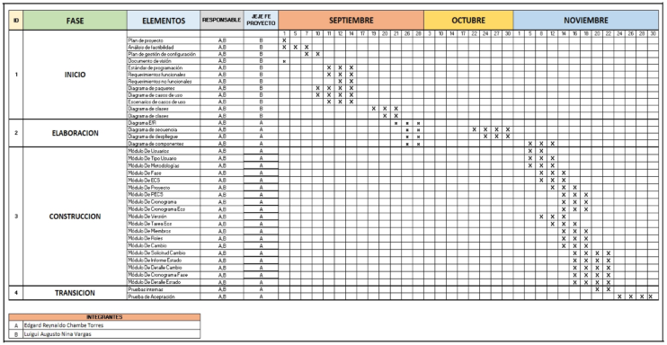
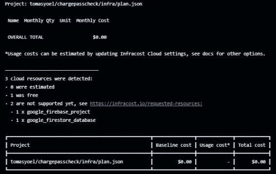



**UNIVERSIDAD PRIVADA DE TACNA** 

**FACULTAD DE INGENIERÍA** 

**Escuela Profesional de Ingeniería de Sistemas** 

` `**Proyecto:**  

**Sistema Gestor de contraseñas: ChargePass**

Curso: *Patrones de Software*\
Docente: Mag. Patrick Cuadros Quiroga 

**Integrantes:**

Chambe Torres, Edgard Reynaldo (2019064917) Nina Vargas, Luigui Augusto  (2019065166) Condori Vargas,Tomas Yoel                     (2018000487)** 

**Tacna – Perú** **2025** 

**ÍNDICE** 

[Resumen  3](#_page2_x85.05_y70.85) 

1. [Antecedentes:  3](#_page2_x85.05_y263.71) 
1. [Título  4](#_page3_x85.05_y243.53) 
1. [Autores  4](#_page3_x85.05_y336.39) 
1. [Planteamiento del Problema  5](#_page4_x85.05_y70.85) 
   1. [Problema  5](#_page4_x85.05_y110.82) 
   1. [Justificación  5](#_page5_x85.05_y70.85) 
   1. [Alcance  6](#_page5_x85.05_y390.92) 
1. [Objetivos  6](#_page6_x85.05_y85.74) 
   1. [Objetivo general  6](#_page6_x85.05_y143.71) 
   1. [Objetivos Específicos  6](#_page6_x85.05_y272.26) 
1. [Marco Teórico  7](#_page7_x85.05_y70.85) 
1. [Desarrollo de la Propuesta  9](#_page8_x85.05_y284.34) 
   1. [Análisis de Factibilidad  9](#_page8_x85.05_y315.41) 
   1. [Tecnología de Desarrollo  11](#_page11_x85.05_y70.85) 
   1. [Metodología de Implementación  13](#_page13_x85.05_y478.27) 
1. [Cronograma:  13](#_page14_x85.05_y70.85) 
1. [Presupuesto del Py :   14](#_page15_x85.05_y70.85) 
1. [Conclusiones  18](#_page18_x85.05_y387.15) 
1. [Bibliografía  19](#_page19_x85.05_y70.85) 

**Resumen** 

Este proyecto busca brindar una solución robusta para la generación segura de contraseñas desde dispositivos móviles o web, validando primero la identidad del  usuario  mediante  verificación  por  correo.  La  aplicación  se  enfocará  en ofrecer una experiencia de usuario intuitiva, segura y orientada a la protección de  datos.  La  incorporación  futura  de  restricciones  por  dominios  de  correo electrónico  asegurará  que  solo  usuarios  autorizados  puedan  registrarse, fortaleciendo aún más la autenticidad de los perfiles en la plataforma. 

1. **Antecedentes:** 

2. **Título** 

**Sistema Gestor de contraseñas: “ChargePass”** 

3. **Autores** 
- Nina Vargas, Luigui Augusto  
- Chambe Torres Edgard Reynaldo 
- Condori Vargas Tomas Yoel

4. **Planteamiento del Problema** 
1. **Problema** 

En  la  actualidad,  muchas  personas  utilizan  contraseñas  débiles, repetidas o poco seguras debido a la dificultad para recordar múltiples credenciales complejas. Esta situación incrementa el riesgo de accesos no  autorizados,  robo  de  identidad  digital  y  vulnerabilidades  en  la protección  de  información  sensible. A pesar de que existen diversas herramientas  para  la  gestión  de  contraseñas,  muchas  de  ellas  no ofrecen un proceso de autenticación previo confiable, ni garantizan una experiencia accesible y segura desde dispositivos móviles. 

Además, el registro de usuarios sin una verificación adecuada puede abrir la puerta a registros fraudulentos o bots, lo que compromete la seguridad  del  sistema  y  la  privacidad  de  los  usuarios.  La  falta  de mecanismos  robustos  de  validación  y  generación  segura  de contraseñas limita la efectividad de estos sistemas como herramientas de protección real frente a amenazas cibernéticas comunes. 

En este contexto, surge la necesidad de una solución moderna, intuitiva y segura que permita a los usuarios registrarse de manera confiable mediante  verificación  por  correo  electrónico,  generar  contraseñas robustas  de  forma  automática  o  personalizada,  y  almacenarlas  de manera  segura.  El  desarrollo  de  ChargePass,  una  aplicación  móvil construida  con  Flutter  y  respaldada  por  Firebase,  busca  cubrir  esta necesidad, integrando funcionalidades clave como el control de acceso autenticado,  la  validación  de  identidad  y  la  generación y gestión de contraseñas seguras, con una visión orientada a proteger la identidad digital de los usuarios y prevenir accesos indebidos. 

2. **Justificación**

ChargePass surge como una solución integral, combinando generación de  contraseñas  seguras,  almacenamiento  cifrado  y  autenticación mediante verificación por correo electrónico. Al implementar un registro validado  y  futuras  restricciones  por  dominio,  se  reduce  el riesgo de cuentas  fraudulentas,  garantizando  que  solo  usuarios  autorizados accedan al sistema. La aplicación, desarrollada con Flutter y Firebase, prioriza  una  experiencia  intuitiva  y  multiplataforma,  facilitando  la adopción de buenas prácticas de ciberseguridad. 

Este proyecto no solo mejora la protección de datos personales, sino que también sienta las bases para funcionalidades avanzadas, como autenticación multifactor (MFA) y análisis de fortaleza de contraseñas. Al promover  contraseñas  robustas  y  gestión  centralizada,  ChargePass contribuye  a  mitigar  vulnerabilidades  comunes,  protegiendo  a  los usuarios en un entorno digital cada vez más amenazado. 

3. **Alcance** 

La solución se presenta como una aplicación móvil (y eventualmente web) que cubre el siguiente conjunto de funcionalidades clave: 

- Registro de usuarios con verificación por correo electrónico. 
- Inicio de sesión únicamente después de la verificación exitosa del correo. 
- Generación de contraseñas mediante: 
- Opción  automática  con  criterios  de  seguridad  establecidos (longitud, caracteres especiales, etc.). 
- Opción manual mediante el ingreso de un token personalizado. 
- Almacenamiento seguro de los registros de contraseña. 

Control de acceso y autenticación mediante Firebase Auth. Posibilidad futura de: 

- Limitar registros según dominios de correo válidos. 
- Implementar extensiones de seguridad (ej. autenticación multifactor, validaciones de dispositivo). 

5. **Objetivos** 
1. **Objetivo general** 
- Desarrollar  e  implementar  "ChargePass",  un  sistema  gestor  de contraseñas  seguro  y  multiplataforma,  que  permita  a  los  usuarios generar,  almacenar  y  administrar  credenciales  robustas  mediante autenticación  verificada  por  correo  electrónico,  garantizando  la protección de su identidad digital. 
2. **Objetivos Específicos** 
- Implementar un sistema de autenticación seguro mediante verificación por correo electrónico, asegurando que solo usuarios legítimos puedan registrarse y acceder al sistema. 
- Diseñar un generador de contraseñas robustas, permitiendo opciones aleatorias  o  personalizadas  bajo  estándares  de  seguridad  (longitud, caracteres especiales, etc.). 
- Integrar  almacenamiento  cifrado  de  contraseñas  utilizando  Firebase, garantizando  la  protección  de  datos  sensibles  contra  accesos  no autorizados. 
- Desarrollar una interfaz intuitiva y accesible en Flutter para dispositivos móviles y web, optimizando la experiencia del usuario en la gestión de credenciales. 
- Establecer  roles  de  usuario  y  administrador,  permitiendo  un  control diferenciado sobre las funcionalidades del sistema (ej.: restablecimiento de contraseñas, gestión de cuentas). 
- Incluir  notificaciones  automáticas  para  alertar  sobre  posibles vulneraciones  o  actividades  sospechosas  en  las  cuentas  de  los usuarios. 
6. **Marco Teórico** 
1. **Gestión Segura de Contraseñas y Ciberseguridad** 

La seguridad de las contraseñas es fundamental en la protección de datos  personales  y  corporativos.  Según  estándares  como  los del NIST  (National  Institute  of  Standards  and  Technology),  una contraseña segura debe combinar longitud, complejidad y unicidad para mitigar riesgos como ataques de fuerza bruta o phishing. Sin embargo,  los  usuarios  suelen  recurrir  a  contraseñas  débiles  o repetidas  por  la  dificultad  de  gestionarlas,  lo  que  incrementa vulnerabilidades.  Herramientas  como  los  gestores de contraseñas buscan  resolver  este  problema  mediante  generación  automática, almacenamiento cifrado y autenticación robusta. 

2. **Autenticación y Verificación de Identidad** 

La  verificación  por  correo  electrónico  es  un  método ampliamente adoptado para garantizar la legitimidad de los usuarios durante el registro.  Sistemas  como  OAuth  2.0  o  Firebase  Authentication permiten  implementar  este  proceso  de  forma  segura,  reduciendo riesgos de cuentas fraudulentas. Además, la futura integración de restricciones  por  dominio  (ej.:  solo  correos  institucionales)  añade una  capa  adicional  de  seguridad,  asegurando  que  solo  usuarios autorizados accedan a la plataforma. 

3. **Tecnologías para el Desarrollo de Gestores de Contraseñas** 

Plataformas  como  Flutter  facilitan  el  desarrollo  de  aplicaciones multiplataforma  (iOS,  Android  y  web)  con  interfaces  intuitivas, mientras  que  Firebase  ofrece  servicios  escalables  para autenticación,  bases de datos cifradas (Firestore) y notificaciones. La  combinación  de  estas  tecnologías  permite  crear  soluciones accesibles  y  seguras,  capaces  de  generar  contraseñas  robustas bajo  algoritmos  como  PBKDF2  o  bcrypt,  que  protegen  contra filtraciones. 

4. **Impacto  de  los  Gestores  de  Contraseñas  en  la  Seguridad Digital** 

   Estudios demuestran que el uso de gestores de contraseñas reduce en un 80% los riesgos asociados a credenciales comprometidas (Google, 2020). Al centralizar y cifrar las contraseñas, herramientas como ChargePass no solo mejoran la protección de datos, sino que también promueven buenas prácticas entre los usuarios, como la activación de autenticación multifactor (MFA) o la renovación periódica de claves. Esto alinea el proyecto con estándares internacionales de ciberseguridad, como ISO/IEC 27001. 

**7. Desarrollo de la Propuesta** 

1. **Análisis de Factibilidad** 
- **Factibilidad Operativa** 

ChargePass ofrecerá beneficios significativos al proporcionar una gestión segura, centralizada  y automatizada de contraseñas, resolviendo problemas críticos de seguridad digital. Los usuarios podrán: 

- Generar y almacenar contraseñas robustas de forma sencilla, reduciendo el riesgo de hackeos o robos de identidad. 
- Acceder  a  sus  credenciales  encriptadas  desde  cualquier  dispositivo,  con autenticación biométrica o multifactor (MFA) para mayor seguridad. 
- Evitar  el  uso  de  contraseñas  repetidas  o  débiles,  protegiendo  sus cuentas personales y laborales. 

**Lista de Interesados:** 

1. Usuarios individuales (personas comunes) que buscan proteger sus cuentas en redes sociales, bancos, correos, etc. 
1. Empresas y equipos IT que necesitan gestionar credenciales compartidas de forma segura. 
1. Desarrolladores de aplicaciones que buscan integrar un sistema de gestión de contraseñas confiable en sus proyectos. 
4. Expertos en ciberseguridad interesados en soluciones accesibles para usuarios no técnicos. 
- **Factibilidad Legal** 

ChargePass cumplirá con todas las normativas de protección de datos y seguridad digital aplicables: 

- A nivel local: Ley N° 29733 (Protección de Datos Personales en Perú). 
- A nivel global: Alineación con estándares como GDPR (UE) y CCPA (EE.UU.) si aplica. 
- Seguridad garantizada: Datos encriptados, consentimiento explícito y políticas claras de privacidad. 
- Software  legal:  Uso  de  tecnologías  open-source  (Flutter,  Firebase)  bajo licencias permitidas. 

En  caso  de  cambios  regulatorios,  se  ajustará  el  sistema  para  mantener  el cumplimiento. 

- **Factibilidad Social** 

ChargePass tendrá un impacto social significativo al abordar problemas críticos de seguridad digital en la población. La aplicación promoverá: 

1. **Seguridad accesible** 
- Interface  intuitiva  que  permite  a  cualquier  usuario,  incluso  con  bajos conocimientos técnicos, gestionar sus contraseñas de forma segura 
- Solución multiplataforma disponible para diversos estratos sociales 
2. **Prevención de riesgos** 
- Reducción de casos de robo de identidad y fraudes en línea 
- Protección de datos sensibles (financieros, personales, laborales) 
3. **Educación digital** 
- Fomento de cultura de ciberseguridad mediante herramientas prácticas 
- Empoderamiento de usuarios en el cuidado de su identidad digital 
4. **Beneficio colectivo** 
- Mayor confianza en transacciones y servicios digitales 
- Protección extendida a comunidades y pequeñas empresas 

La  implementación  de  ChargePass  contribuirá  a  crear  un  entorno  digital  más seguro y consciente, beneficiando tanto a individuos como a la sociedad en su conjunto. 

- **Factibilidad Ambiental**  

ChargePass promoverá la sostenibilidad ambiental a través de: 

**Reducción de impacto digital** 

- Minimiza la necesidad de reposición de credenciales (evitando procesos que consumen energía) 
- Optimiza  el  almacenamiento  en  la  nube  mediante  tecnología  eficiente  de Firebase 

**Contribución a los ODS** 

- ODS 9: Industria, Innovación e Infraestructura 

  Al  ofrecer  una  solución  tecnológica  segura  y  accesible  que  promueve infraestructuras digitales más resilientes 

- ODS 12: Producción y Consumo Responsables 

  Fomenta el uso eficiente de recursos digitales y reduce la huella de carbono asociada a brechas de seguridad 

**Operación sostenible** 

- Infraestructura cloud con proveedores comprometidos con energías renovables (Google Cloud/Firebase) 
- Cero uso de papel en todos los procesos de gestión de contraseñas 
- Diseño eficiente que reduce el consumo energético en dispositivos móviles 

**Gestión responsable** 

- Ciclo de vida del producto diseñado para minimizar e-waste (actualizaciones compatibles con dispositivos antiguos) 
- Compromiso con estándares de TI Verde en el desarrollo y mantenimiento **Impacto ambiental positivo:** 
- Reducción indirecta de emisiones al prevenir fraudes que requieren procesos digitales 
- Promoción de la seguridad digital como pilar de la sostenibilidad tecnológica 
- Alineación con políticas de carbono neutralidad de los proveedores cloud 

El proyecto garantiza que su huella ambiental sea mínima mientras contribuye a construir entornos digitales más sostenibles. 

2. **Tecnología de Desarrollo** 

   Utilizamos  tres  indicadores  clave  para  evaluar  la  viabilidad  económica  del proyecto: 

- Beneficio/Costo (B/C) → Para validar si los beneficios superan los costos. 
- Valor  Actual  Neto  (VAN)  →  Para  determinar  si  el proyecto genera valor económico aceptable. 
- Tasa  Interna  de  Retorno  (TIR)  →  Para  asegurar  que  la  inversión  sea recuperable en el tiempo. 

Estos criterios garantizan que el proyecto cumpla con los requisitos financieros y sea económicamente sostenible. 

**EGRESOS:** 

*Tabla 16: Cuadro de Gastos del Proyecto*

|**Gastos del Proyecto** ||||
| - | :- | :- | :- |
|**Descripción:** |Este cuadro detalla los gastos asociados al proyecto, incluyendo costos para el hosting web, servicios de un ingeniero de software, operador de mantenimiento y la base de datos en la nube. |||
|**Gastos**  |**pu** |**cantidad** |**subtotal** |
|Hosting Web |25 |1 |25 |
|Ingeniero de software |2500 |1 |2500 |
|Infraestructura |0 |1 |0 |
||||2525 |
|Total de egresos ||x 12 meses |30300 |

*Fuente: Elaboración propia del equipo de trabajo* 

*Tabla 16:  Apreciamos el cuadro de Gastos del Proyecto,se detalla los gastos asociadas al proyecto.*

**Ingreso anual estimado del Proyecto:** 

*Tabla 17: Cuadro de Inversión y Beneficios*

|**Cuadro de Inversión y Beneficios** |||||
| - | :- | :- | :- | :- |
|**Inversión:   S/. 12540**             |**PPTO** |**DEL PY**|**Tasa Des**|**cuento: 9%** |
|**Ingreso** |**Mensual** |**Anual** |||
|Reducción de costos operativos (30%) |2000|24000|||
|Ahorro en consumo de recursos (20%) |1500|18000|||
|**Ingreso total anual** ||48000|||

*Fuente: Elaboración propia del equipo de trabajo \
Tabla 17:  Apreciamos el cuadro de Inversiones y Beneficios.* 

**Flujo de Caja del Proyecto:** 

*Tabla 18: Cuadro de Flujo de Caja* 

|**Cuadro de Flujo de Caja** ||||
| - | :- | :- | :- |
|**Periodo** |**Ingreso** |**Egreso** |**flujo efectivo** |
|0|||-12540|
|1|42000|30300|11700|
|2|42000|30300|11700|
|3|42000|30300|11700|

*Fuente: Elaboración propia del equipo de trabajo* 

*Tabla 18:  Apreciamos de flujo de caja del Proyecto,se adjunta los detalles más abajo el anexo 01.* 

**Van:** S/ 17.076,15

**TIR**: 76%

**Índice de Rentabilidad(B/C)**: S/. 2.36

1. **Relación Beneficio/Costo (B/C)** 
- En base a los estudios de costos realizados, obtuvimos: 

**B/C =** S/. 2.36

significa que por cada sol invertido, se generarán aproximadamente 2.36 soles de beneficio. Esto refuerza la idea de que el proyecto es financieramente factible

2. **Valor Actual Neto (VAN)** 
- Para este caso, los resultados del análisis son: 

VAN  >  0,  Esto quiere decir que el valor actualizado de los 

futuros ingresos y desembolsos de inversión, a la tasa de descuento elegida, generará utilidades para la empresa. 

**Van =** S/ 17.076,15

3. **Tasa Interna de Retorno (TIR)** 

   En el presente sistema utilizamos la TIR como la mejor herramienta de cálculo porque nos da mayor seguridad para la toma de decisiones favorables. 

   El resultado obtenido es: Tasa de Descuento del 76% 

3. **Metodología de Implementación**

Anexo: Anexos del Proyecto 

8. **Cronograma:** 

*Gráfico 01:Cronograma del proyecto*

*Fuente: Elaboración propia del equipo de trabajo* 

*Se detalla en el siguiente cuadro el cronograma del desarrollo  del proyecto* 

9. **Presupuesto del Py :**  

**Monto de Inversión (En Soles):  S/. 12980**

Justificación de la Inversión 

La inversión en ChargePass se justifica por su capacidad para fortalecer la seguridad digital de los usuarios mediante un sistema de gestión de contraseñas robusto y accesible. Al implementar autenticación verificada por correo, generación automática de claves seguras y almacenamiento cifrado, el proyecto reducirá significativamente riesgos como robo de identidad, filtraciones de datos y accesos no autorizados. Además, la escalabilidad de la plataforma (basada en Flutter y Firebase) permitirá adaptarse a futuras demandas, como la integración de autenticación multifactor (MFA) o sincronización multiplataforma, asegurando un retorno sostenible de la inversión. 

Beneficios del Proyecto Beneficios tangibles: 

Reducción de costos por brechas de seguridad: Evita gastos asociados a fraudes o recuperación de cuentas comprometidas, que pueden alcanzar hasta S/ 50,000 anuales para pequeñas y medianas empresas (según estudios de ciberseguridad). 

Optimización de tiempo: Elimina la necesidad de restablecer contraseñas olvidadas, ahorrando hasta 30 horas anuales por usuario en gestión manual. 

Beneficios intangibles: 

Confianza del usuario: Fortalece la percepción de seguridad en plataformas digitales. 

Cultura de ciberseguridad: Fomenta prácticas seguras como el uso de contraseñas únicas y complejas. 

**Criterios de Inversión** 

Nuestros criterios de inversión se basan en los tres criterios presentados en base a que  se  necesitará  el  B/C  para  saber  si  hay  beneficios,  El  VAN  para  saber si es aceptable el valor del proyecto y el TIR si es que se puede obtener retornar los gastos, ya que necesitamos recuperar de los costos invertidos al desarrollarse en el trayecto del tiempo. En ello, podemos utilizar estos criterios debido a que queremos que el proyecto  cumpla  con  todos  los  requisitos  y  con  los  valores  económicos  para  ser aceptado 

**EGRESOS:** 

*Tabla 01: Cuadro de Gastos del Proyecto*

|**Gastos del Proyecto** ||||
| - | :- | :- | :- |
|**Descripción:** |Este cuadro detalla los gastos asociados al proyecto, incluyendo costos para el hosting web, servicios de un ingeniero de software, operador de mantenimiento y la base de datos en la nube. |||
|**Gastos**  |**pu** |**cantidad** |**subtotal** |
|Hosting Web |25 |1 |25 |
|Ingeniero de software |2500 |1 |2500 |
|Operador de mantenimiento |2500 |1 |2500 |
|Base de datos en la nube |150 |1 |150 |
||||5175 |
|Total de egresos ||x 12 meses |62100 |

*Fuente: Elaboración propia del equipo de trabajo* 

*Tabla 01:  Apreciamos el cuadro de Gastos del Proyecto,se detalla los gastos asociadas al proyecto.* 

**Ingreso anual estimado del Proyecto:** 

*Tabla 02: Cuadro de Inversión y Beneficios*

|**Cuadro de Inversión y Beneficios** |||
| - | :- | :- |
|**Inversión:   S/. 13350**                      |**PPTO DEL PY**|**Tasa Descuento: 9%** |

|**Ingreso** |**Mensual** |**Anual** |
| - | - | - |
|Reducción de costos operativos (30%) |5000|60000|
|Ahorro en consumo de recursos (20%) |2500|30000|
|**Ingreso total anual** ||90000|

*Fuente: Elaboración propia del equipo de trabajo \
Tabla 12:  Apreciamos el cuadro de Inversiones y Beneficios.* 

**Flujo de Caja del Proyecto:** 

*Tabla 03: Cuadro de Flujo de Caja* 

|**Cuadro de Flujo de Caja** ||||
| - | :- | :- | :- |
|**Periodo** |**Ingreso** |**Egreso** |**flujo efectivo** |
|0|||-12980|
|1|90000|62100|27900|
|2|90000|62100|27900|
|3|90000|62100|27900|

*Fuente: Elaboración propia del equipo de trabajo* 

*Tabla 03:  Apreciamos el flujo de caja del Proyecto,se adjunta los detalles mas abajo el anexo 01.* 

### **Reporte de Infracost**

10. **Conclusiones** 
- El  proyecto  ChargePass  ha  demostrado  ser  viable  técnica,  económica  y legalmente,  representando  una  solución  óptima  para  la  gestión  segura  de contraseñas en el entorno digital actual. 
- La  inversión  estimada  en  el  desarrollo  e  implementación  está  plenamente justificada por los beneficios en seguridad digital que proporcionará a usuarios individuales y organizaciones. 
- ChargePass  mejorará  sustancialmente  la  protección  de  datos  personales, fomentará  buenas  prácticas  de ciberseguridad y fortalecerá la confianza en transacciones digitales. 
- Los riesgos identificados durante el análisis cuentan con planes de mitigación efectivos,  garantizando  una  implementación  exitosa  y  un  funcionamiento continuo seguro y estable. 
- Este  proyecto  no  solo  resuelve  un  problema  tecnológico  actual,  sino  que contribuye a crear una cultura de seguridad digital en la sociedad peruana.
11. **Bibliografia** 
- Boyd, C. E. (2020). Water quality: An introduction (3rd ed.). Springer. 
- Cotruvo, J. A. (2018). Water, Sanitation, and Hygiene. Elsevier. 
- Alley, W. M. (2006). *Geohydrology of the Upper Floridan Aquifer in the Southeastern United States*. U.S. Geological Survey. https://pubs.usgs.gov/bul/2197/ 
